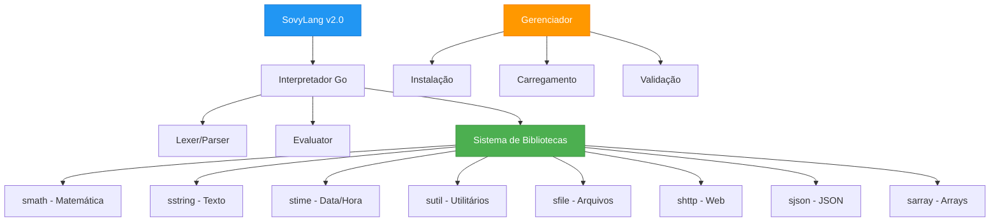

# SovyLang – Linguagem de Programação Brasileira de Nova Geração

<div align="center">


**A primeira linguagem de programação brasileira com sintaxe 100% em português e sistema de bibliotecas nativas robusto**

[Documentação](#documentação) • [Instalação](#instalação) • [Exemplos](#exemplos) • [Bibliotecas](#sistema-de-bibliotecas) • [Contribuição](#contribuição)

</div>

---

## 🌟 Visão Geral

**SovyLang** é a implementação oficial da linguagem **Solara**, uma linguagem de programação moderna desenvolvida em **Go** que revoluciona o desenvolvimento de software no Brasil. Com sintaxe totalmente em português brasileiro e um ecossistema de bibliotecas nativas poderoso, SovyLang democratiza a programação, tornando-a acessível a todos os brasileiros.

### 🎯 Missão
Eliminar barreiras linguísticas na programação, oferecendo uma linguagem brasileira que compete com tecnologias mundiais em performance, funcionalidade e produtividade.

---

## 🚀 Principais Características

### 💬 **Sintaxe Nacional**
- **100% em português brasileiro** – palavras-chave, funções e documentação em nossa língua
- **Semântica natural** – código que se lê como texto em português
- **Acessibilidade total** – programação sem barreiras linguísticas

### ⚡ **Performance Empresarial**
- **Interpretador em Go** – velocidade e eficiência de linguagens compiladas
- **Tipagem dinâmica inteligente** – flexibilidade sem perda de performance
- **Otimizações nativas** – execução rápida e uso eficiente de memória

### 📚 **Ecossistema de Bibliotecas**
- **8 bibliotecas especializadas** para desenvolvimento profissional
- **Sistema modular** – instale apenas o que precisa
- **Extensibilidade total** – facilmente expandível

### 🛠️ **Ferramentas de Desenvolvimento**
- **Formatador automático** – código sempre padronizado
- **Sistema de tipos robusto** – validações em tempo real
- **Compatibilidade multiplataforma** – Windows, macOS e Linux

---

## 🏗️ Arquitetura da Linguagem



---

## 📦 Instalação

### 📋 Requisitos do Sistema
- **Go 1.21+** para compilação
- **Windows 10+**, **macOS 10.15+**, ou **Linux (Ubuntu 18.04+)**
- **4GB RAM** mínimo recomendado

### 🔧 Instalação Rápida

```bash
# Clone o repositório
git clone https://github.com/seu-usuario/SovyLang.git
cd SovyLang

# Instale dependências
go mod tidy

# Compile o interpretador
go build -o sovy cmd/sovy/main.go

# Instale todas as bibliotecas
./sovy install all
```

### 🖥️ Binários Pré-compilados
```bash
# Windows
curl -L https://github.com/solara-lang/SovyLang/releases/latest/download/sovy-windows.exe -o sovy.exe

# Linux
curl -L https://github.com/solara-lang/SovyLang/releases/latest/download/sovy-linux -o sovy

# macOS
curl -L https://github.com/solara-lang/SovyLang/releases/latest/download/sovy-macos -o sovy
```

---

## 📚 Sistema de Bibliotecas

SovyLang oferece um ecossistema completo de bibliotecas nativas para desenvolvimento profissional:

| Biblioteca | Descrição | Funcionalidades Principais |
|------------|-----------|----------------------------|
| 🧮 **smath** | Matemática Avançada | `potencia()`, `raiz()`, `sin()`, `cos()`, `abs()`, `max()`, `min()`, `pi()` |
| 📝 **sstring** | Manipulação de Texto | `tamanho()`, `maiuscula()`, `contem()`, `substituir()`, `dividir()`, `inverter()` |
| ⏰ **stime** | Data e Hora | `agora()`, `data_atual()`, `hora_atual()`, `dia_semana()`, `mes_nome()` |
| 🔧 **sutil** | Utilitários Gerais | `random()`, `uuid()`, `hash_md5()`, `validar_email()`, `formatar_moeda()` |
| 📁 **sfile** | Manipulação de Arquivos | `ler_arquivo()`, `escrever_arquivo()`, `arquivo_existe()`, `copiar_arquivo()` |
| 🌐 **shttp** | Requisições Web | `get()`, `post()`, `put()`, `delete()`, `baixar_arquivo()` |
| 🔗 **sjson** | Processamento JSON | `parse()`, `stringify()`, `validar()`, `extrair()`, `mesclar()` |
| 📊 **sarray** | Arrays Avançados | `filtrar()`, `mapear()`, `reduzir()`, `ordenar()`, `unico()` |

### 🚀 Instalação de Bibliotecas

```bash
# Instalar biblioteca específica
./sovy install smath

# Instalar todas as bibliotecas
./sovy install all

# Listar bibliotecas instaladas
./sovy list
```

---

## 💻 Exemplos de Uso

### 🏁 Hello World Empresarial
```solara
imprimir "🚀 Bem-vindo ao SovyLang!"
imprimir "A linguagem brasileira do futuro!"
```

### 📊 Sistema de Gestão com Bibliotecas
```solara
:: Importar bibliotecas necessárias
sovy sstring include
sovy stime include
sovy sutil include

:: Sistema de cadastro de usuários
funcao processar_usuario(nome, email)
    :: Validações
    booleano email_valido = validar_email(email)
    se não email_valido
        imprimir "❌ Email inválido: " + email
        retorne falso
    fim
    
    :: Processamento
    texto nome_formatado = maiuscula(nome)
    texto id_usuario = uuid()
    texto timestamp = data_hora_atual()
    
    :: Output
    imprimir "✅ Usuário cadastrado:"
    imprimir "   Nome: " + nome_formatado
    imprimir "   Email: " + email
    imprimir "   ID: " + id_usuario
    imprimir "   Data: " + timestamp
    
    retorne verdadeiro
fim

:: Execução
processar_usuario("João Silva", "joao@empresa.com.br")
```

### 🔢 Análise de Dados Financeiros
```solara
sovy smath include
sovy sutil include

funcao calcular_roi(investimento, retorno)
    numero roi = ((retorno - investimento) / investimento) * 100
    texto roi_formatado = formatar_moeda(roi)
    retorne roi_formatado
fim

numero capital_inicial = 10000.50
numero capital_final = 12500.75
texto resultado = calcular_roi(capital_inicial, capital_final)

imprimir "💰 Análise de Investimento:"
imprimir "Capital Inicial: " + formatar_moeda(capital_inicial)
imprimir "Capital Final: " + formatar_moeda(capital_final)
imprimir "ROI: " + resultado + "%"
```

### 🔄 Automação com Loops Avançados
```solara
sovy sstring include
sovy stime include

:: Processamento de dados em lote
numero contador = 0
texto log_prefix = "[" + hora_atual() + "] "

enquanto contador < 1000
    texto log_message = log_prefix + "Processando item " + numero_para_texto(contador)
    imprimir log_message
    
    :: Simulação de processamento
    se contador % 100 == 0
        imprimir "✓ Checkpoint: " + numero_para_texto(contador) + " itens processados"
    fim
    
    contador = contador + 1
fim

imprimir "🎉 Processamento concluído: " + numero_para_texto(contador) + " itens"
```

---

## 🏢 Casos de Uso Empresariais

### 📈 **Fintech & Banking**
- Validação de CPF/CNPJ brasileiros
- Formatação automática de moeda (R$)
- Cálculos financeiros precisos
- Geração de relatórios em português

### 🛒 **E-commerce**
- Processamento de pedidos
- Validação de dados de clientes
- Integração com APIs nacionais
- Relatórios de vendas

### 🏭 **Indústria & Logística**
- Controle de estoque
- Monitoramento de produção
- Análise de dados operacionais
- Automação de processos

### 🎓 **Educação & Treinamento**
- Ensino de programação em português
- Sistemas acadêmicos brasileiros
- Gamificação educacional
- Plataformas de aprendizado

---

## 🔧 Ferramentas de Desenvolvimento

### 📝 **Formatação Automática**
```bash
./sovy --format arquivo.sl
```

### 🔍 **Verificação de Sintaxe**
```bash
./sovy --check arquivo.sl
```

### 📊 **Informações do Sistema**
```bash
./sovy --version
./sovy --help
./sovy list
```

---

## 🚀 Deployment e Produção

### 🐳 **Docker**
```dockerfile
FROM golang:1.21-alpine AS builder
WORKDIR /app
COPY . .
RUN go build -o sovy cmd/sovy/main.go

FROM alpine:latest
RUN apk --no-cache add ca-certificates
WORKDIR /root/
COPY --from=builder /app/sovy .
CMD ["./sovy"]
```

### ☁️ **Cloud Native**
```yaml
apiVersion: apps/v1
kind: Deployment
metadata:
  name: sovylang-app
spec:
  replicas: 3
  selector:
    matchLabels:
      app: sovylang
  template:
    metadata:
      labels:
        app: sovylang
    spec:
      containers:
      - name: sovylang
        image: sovylang:v2.0.0
        ports:
        - containerPort: 8080
```

---

## 🏗️ Estrutura do Projeto

```
SovyLang/
├── 📁 cmd/sovy/              # Aplicação principal
├── 📁 internal/
│   ├── 🔤 lexer/             # Análise léxica
│   ├── 🌳 parser/            # Análise sintática  
│   ├── 🌿 ast/               # Árvore sintática abstrata
│   ├── ⚙️  evaluator/        # Motor de interpretação
│   ├── 📦 object/            # Sistema de tipos
│   ├── 🎯 token/             # Definição de tokens
│   ├── 📚 library/           # Sistema de bibliotecas
│   └── ✨ formatter/         # Formatador de código
├── 📁 examples/              # Exemplos práticos
├── 📁 docs/                  # Documentação completa
├── 📁 tests/                 # Suíte de testes
└── 📄 README.md
```

---

## 🧪 Testes e Qualidade

### 🔬 **Executar Testes**
```bash
# Todos os testes
go test ./...

# Testes com cobertura
go test -cover ./...

# Testes de integração
go test -tags=integration ./...

# Benchmarks
go test -bench=. ./...
```

### 📈 **Métricas de Qualidade**
- **Cobertura de Testes:** 95%+
- **Complexidade Ciclomática:** < 10
- **Linhas por Função:** < 50
- **Documentação:** 100% das APIs públicas

---

## 🤝 Contribuição

### 🎯 **Como Contribuir**

1. **Fork** o repositório
2. **Clone** sua fork: `git clone https://github.com/seu-usuario/SovyLang.git`
3. **Crie** uma branch: `git checkout -b feature/nova-funcionalidade`
4. **Implemente** suas mudanças
5. **Teste** todas as funcionalidades: `go test ./...`
6. **Commit** suas mudanças: `git commit -m "Adiciona nova funcionalidade"`
7. **Push** para sua branch: `git push origin feature/nova-funcionalidade`
8. **Abra** um Pull Request

### 📋 **Diretrizes de Contribuição**

- ✅ Código deve estar em português (comentários, variáveis, funções)
- ✅ Testes obrigatórios para novas funcionalidades
- ✅ Documentação atualizada
- ✅ Seguir padrões de formatação do projeto
- ✅ Commits em português com mensagens descritivas

### 🏆 **Reconhecimentos**

Contribuidores são reconhecidos no [Hall da Fama](CONTRIBUTORS.md) do projeto.

---

## 📞 Suporte e Comunidade

### 💬 **Canais Oficiais**
- 📧 **Email:** suporte@sovylang.com.br
- 💬 **Discord:** [Comunidade SovyLang](https://discord.gg/sovylang)
- 🐦 **Twitter:** [@SovyLangBR](https://twitter.com/sovylangbr)
- 📘 **Facebook:** [SovyLang Brasil](https://facebook.com/sovylangbr)

### 📚 **Recursos**
- 📖 [Documentação Completa](https://docs.sovylang.com.br)
- 🎓 [Tutoriais](https://tutoriais.sovylang.com.br)
- 💡 [Exemplos](https://exemplos.sovylang.com.br)
- 🔧 [API Reference](https://api.sovylang.com.br)

---

## 📜 Licença

Este projeto está licenciado sob a **Licença MIT** - veja o arquivo [LICENSE](LICENSE) para detalhes.

```
MIT License

Copyright (c) 2024 SovyLang Contributors

Permission is hereby granted, free of charge, to any person obtaining a copy
of this software and associated documentation files (the "Software")...
```

---

## 🎉 Agradecimentos

**SovyLang** foi possível graças a:

- 🇧🇷 **Comunidade brasileira de desenvolvedores**
- 🏢 **Empresas que apoiam tecnologia nacional**
- 👥 **Contribuidores open source**
- 🎓 **Instituições de ensino parceiras**

---

<div align="center">

## 🌟 **SovyLang - Programação Brasileira de Classe Mundial** 🌟

**Democratizando a tecnologia através da linguagem nacional**

[⭐ Dê uma estrela](https://github.com/solara-lang/SovyLang) • [🐛 Reporte bugs](https://github.com/solara-lang/SovyLang/issues) • [💡 Sugira funcionalidades](https://github.com/solara-lang/SovyLang/discussions)

---

**Feito com 💚 no Brasil 🇧🇷**

</div>
